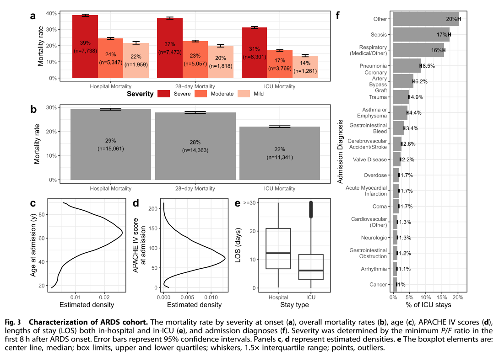
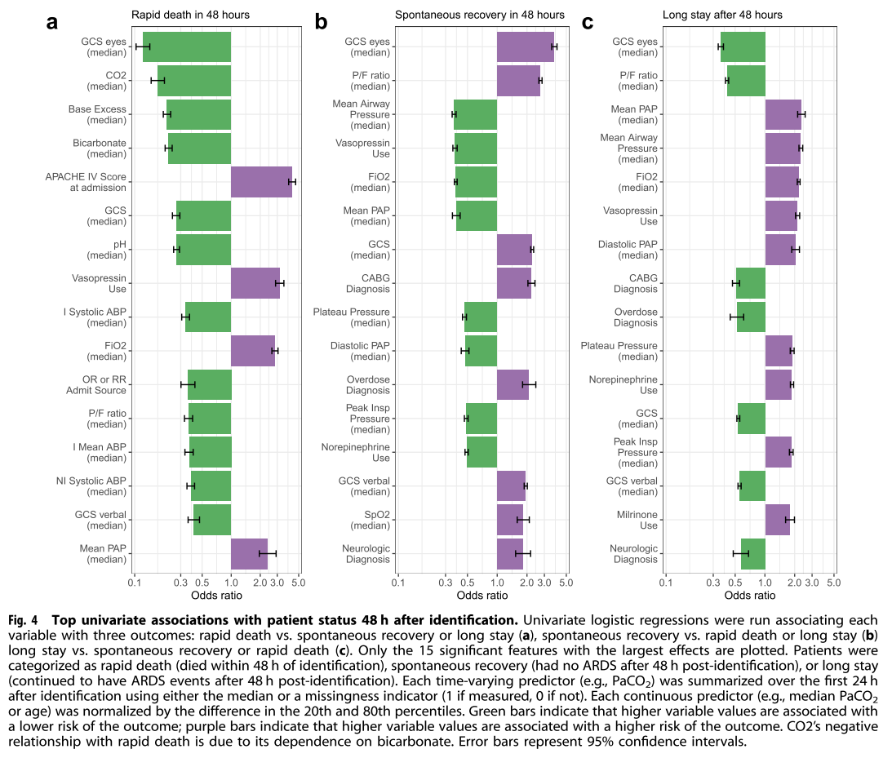
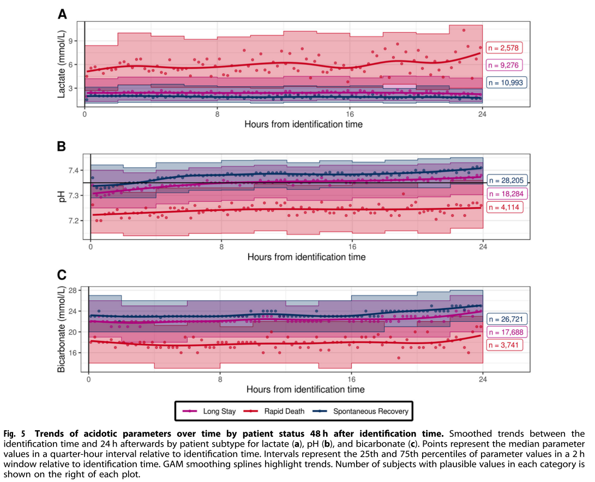
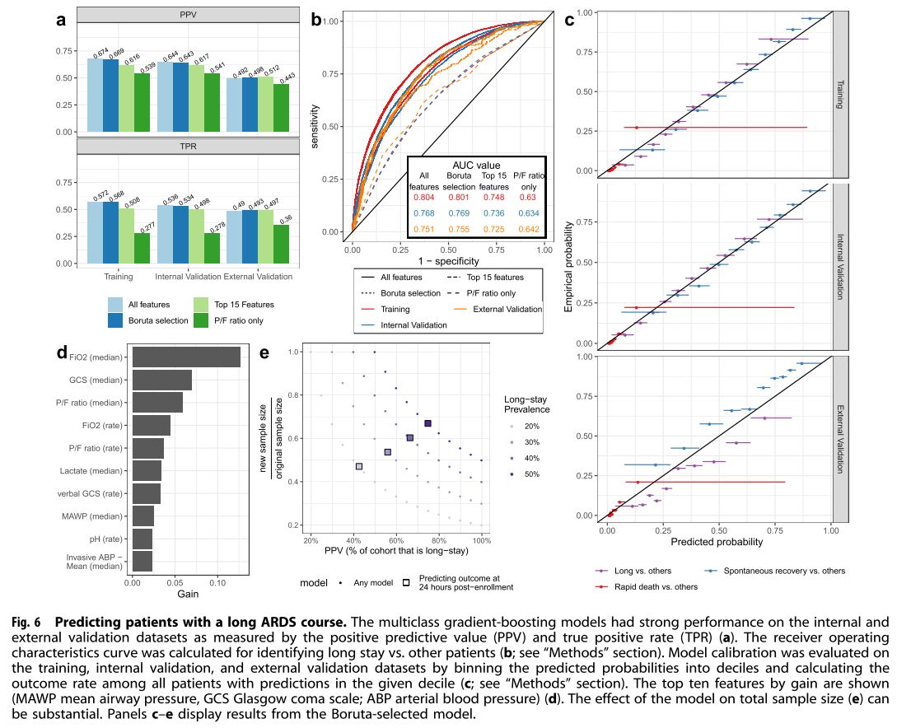

## Figure




```yaml
paper: Utilizing machine learning to improve clinical trial design for acute respiratory distress syndrome
data info:
  data label: long_stay/rapid_death/spontaneous_recovery
  fig 3:
    name: Characterization of ARDS cohort.
    explanation: Four statistical sub figure need one kinds of data.
    data time: 24h after ARDS identification
    data format: data_label, min_pf_8h, hospital_mortality_status, 28d_mortality_status, icu_mortality_status, age, apache_score, hospital_los, icu_los, admission_diagnosis_group

  fig 4:
    name: Top univariate associations with patient status 48 h after identification.
    explanation: Three univariate sub figure need one kinds of data.(58 dynamic features)
    data time: 24h after ARDS identification
    data format: data_label, dynamic_feature_median, dynamic_feature_variance, dynamic_feature_rate_change

  fig 5:
    name: Trends of acidotic parameters over time by patient status 48 h after identification time.
    explanation: Three sub figure need three kinds of lab data(Lactate,PH and Bicarbonate), each lab data need two types of data(point and box).So there are six files of this experiment.
    data time: 24h after ARDS identification
    data format:
      point: data_label, lab_data_offset(each 15m), lab_data_value
        example: long_stay, 45, 8
      box: data_label, lab_data_section_start(each 2h),  lab_data_section_end， lab_data_section_25th, lab_data_section_75th
        example: long_stay, 6, 8, 5.1, 8.2
  fig 6:
    name: Predicting patients with a long ARDS course.
    explanation: There are four feature subsets of all features, top 15 features, bortua selection features and P/F ratio only, which used to train model.
    data time: 24h after ARDS identification
    data format: data_label, static_feature(4+5+26), indictator_feature(10) and dynamic_feature(58*3)

```